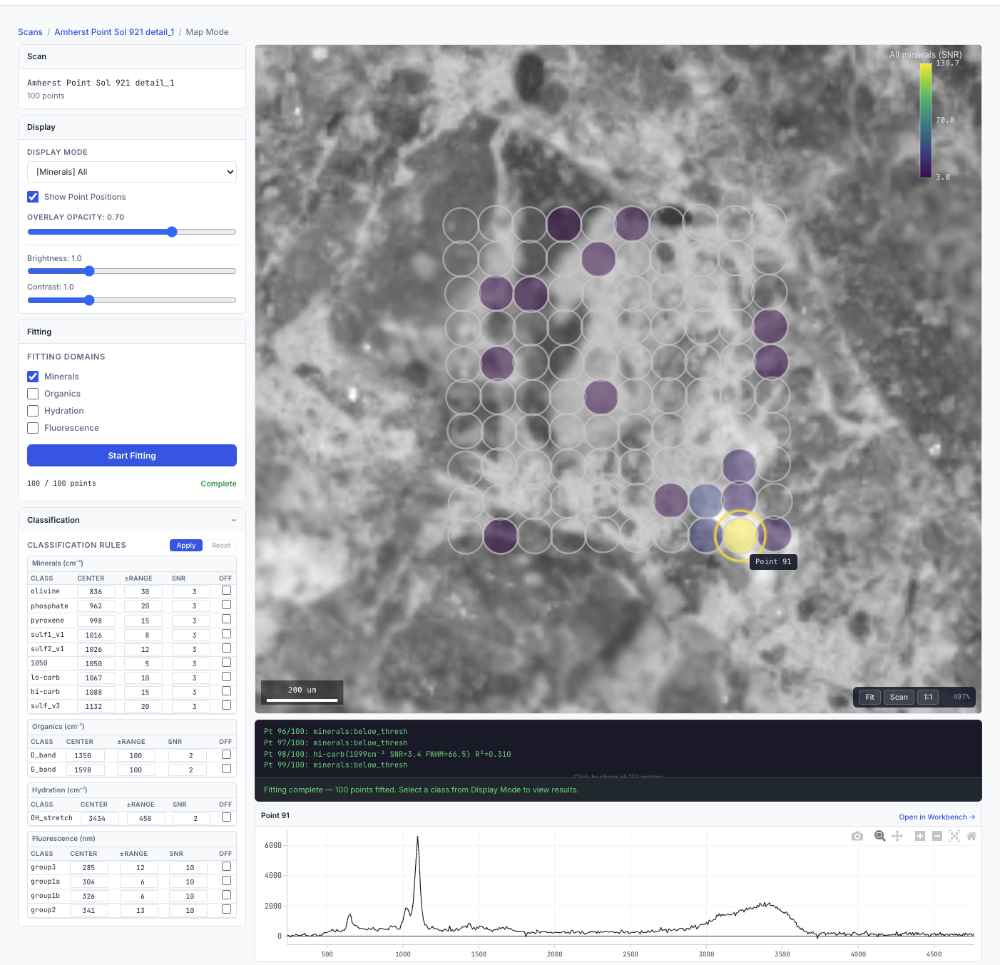
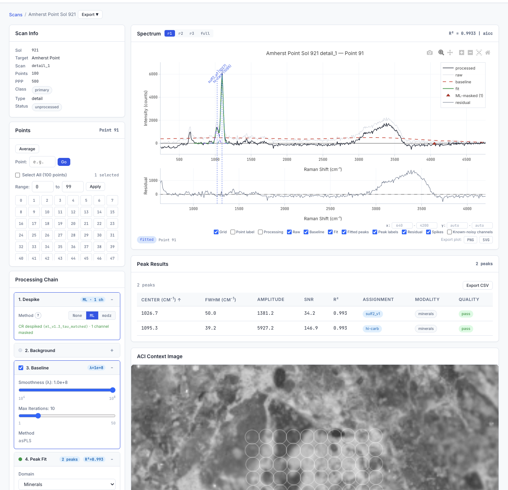
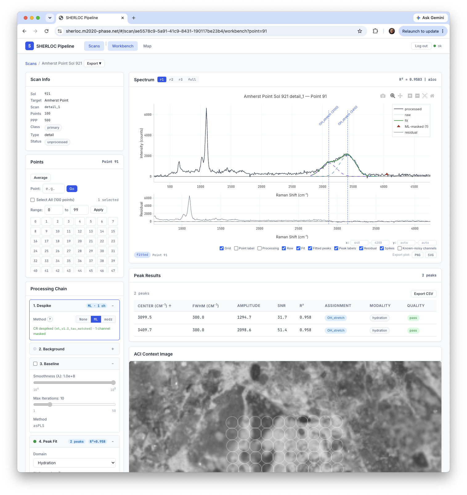
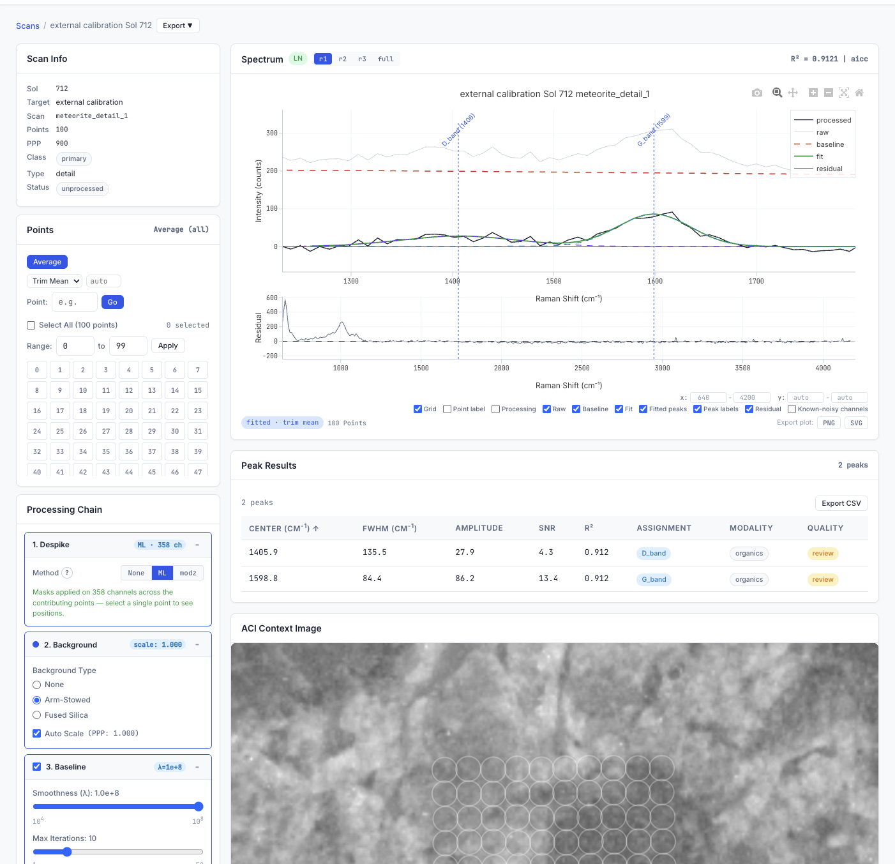

# SHERLOC Pipeline

**Ken Williford**  
Blue Marble Space Institute of Science  
ken@bmsis.org

Mars 2020 SHERLOC Raman/fluorescence data processing pipeline for automated spectral analysis, multi-domain peak persistence, and spatial visualization.

---

## Overview

This pipeline provides a command line interface for automated processing of SHERLOC Loupe datasets including transformation, laser normalization, cosmic-ray despiking, baseline fit and subtraction, background subtraction, spectral averaging, peak detection and analysis by Gaussian fitting, preliminary peak assignment (to mineral class, hydration feature and/or organic feature), fluorescence fitting with group assignment, and spatial mapping of assigned peaks that meet acceptance criteria to scan point locations on ACI images.

It also includes a browser-based web application — a Svelte single-page app on a FastAPI backend — for interactive exploration of processed data: spectra, fitted peaks, mineral/organic/hydration/fluorescence classifications, and per-point localization on ACI context images (see screenshots below).

**Key capabilities:**

- **ML cosmic-ray despiking** — a trained neural-network detector (the default) that removes detector cosmic rays per `(point, region)`; masks are persisted to the database and applied at serving time
- **Raman peak fitting** across three domains: minerals, organics, and hydration bands
- **Fluorescence fitting** using differential evolution optimization with three-tier saturation handling
- **Multi-domain persistence** to SQLite via a unified `fitted_peaks` table with `fit_modality` discriminator
- **Backfill** all four domains (minerals, organics, hydration, fluorescence) across the full mission dataset
- **Training data extraction** in JSONL format for cross-modal analysis (Raman + fluorescence co-occurrence)
- **Spatial visualization** of peak detections overlaid on ACI context images

---

## Live deployment

SHERLOC Pipeline runs in production as part of the **PHASE** (Planetary Hyperspectral Analysis and Synthesis Environment) platform at **[m2020-phase.net](https://m2020-phase.net)**, serving the NASA Mars 2020 science team. The web application ships as a multi-architecture (amd64 + arm64) container with tag-triggered CI/CD; to run it yourself, see [Run with Docker](#run-with-docker).

### Map Mode



*Autonomous peak fitting, mineral classification, and per-point localization overlaid on the ACI image of a Mars rock target (Amherst Point, Sol 921).*

### Workbench Mode

Workbench exposes the full per-point processing chain — ML cosmic-ray despiking → instrument-background subtraction → tunable baseline fit/subtraction → Raman and fluorescence peak fitting — with autonomous classification into mineral, organic, hydration, and fluorescence features.



*Autonomous sulfate and carbonate (ν₁) detections in a single SHERLOC spectrum, with the full processing chain applied (Amherst Point, Sol 921).*



*Autonomous Raman hydration (O–H stretch) detection in the same spectrum.*



*Autonomous organic (D- and G-band) detection in the SaU-008 Martian meteorite on SHERLOC's calibration target (Sol 712), after despiking, arm-stowed background subtraction, and baseline correction.*

---

## Installation

```bash
git clone https://github.com/archaeon-ai/sherloc-pipeline.git
cd sherloc-pipeline

python -m venv .venv
source .venv/bin/activate  # Windows: .venv\Scripts\activate

pip install -U pip
pip install -e .
```

Optional extras:

```bash
pip install -e ".[pds]"          # PDS download client (sherloc pds-download)
pip install -e ".[web]"          # FastAPI web UI (sherloc serve)
pip install -e ".[ml-despike]"   # ML cosmic-ray detector (default from 4.2.0; onnxruntime)
pip install -e ".[ml]"           # SAM-based grain segmentation
pip install -e ".[dev]"          # test + lint tooling
```

Bootstrap a working directory and database:

```bash
sherloc init --mode pds   # creates data/, outputs/, .cache/sherloc/, runs migrations
```

Verify installation:

```bash
sherloc --help
```

---

## Configuration

Edit `src/sherloc_pipeline/config.yaml` before first use:

```yaml
paths:
  data_root: "../data/loupe"      # Path to your Loupe data directory
  results_root: "../results"       # Where to save pipeline outputs
```

The pipeline relies on Loupe v5.1.5 format data. See [the Loupe repository](https://github.com/nasa/Loupe).

---

## Using PDS data (no Loupe access required)

The full automated pipeline (`full-pipeline`, `process-new`) consumes Loupe-format
workspaces produced by the SHERLOC team's tools. Without Loupe access you can still
download, ingest, browse, and **interactively fit** the publicly archived SHERLOC
data products from the [PDS Geosciences Node](https://pds-geosciences.wustl.edu/missions/mars2020/sherloc.htm):

```bash
pip install -e ".[pds,web]"                     # PDS client + web UI

sherloc pds-download --sol 921                  # fetch a sol's PDS products → ./pds/
sherloc pds-ingest   --sol 921                  # ingest → ./phase_pds.db

SHERLOC_DB=./phase_pds.db ./scripts/serve.sh    # serve at http://localhost:8000
```

Open **http://localhost:8000**, select a scan and point, and use **Workbench Mode**
to run the full per-point chain — despike → background subtraction → baseline →
Raman/fluorescence fitting → classification — interactively on any PDS spectrum.

**Works with PDS-only data:**

- Download + ingest of PDS4 spectral products (RRS/RCS), laser-shot positions, and ACI context-image metadata
- Browsing scans, points, and spectra in the web UI
- Interactive per-point peak fitting and classification in the Workbench

**Requires Loupe data:**

- **Target names** — PDS labels carry sol, SCLK, and scan type but not the team's target names, so targets ingest as `NULL` (a curated mapping file can supply them; see the guide).
- **Batch peak persistence and Map Mode overlays** — `full-pipeline` reads Loupe working directories, so persisted fitted peaks and the spatial Map Mode view come from Loupe data. Use the Workbench to fit PDS spectra interactively.

See the **[PDS Ingestion Guide](docs/guides/PDS_INGESTION_GUIDE.md)** for the full
command surface (sol ranges, `--auto`, dry-run, version handling, troubleshooting).

---

## Usage

### 1. Full Pipeline

Process a complete scan from raw data to spatial overlays:

```bash
sherloc full-pipeline <sol> <target> <scan>
```

**Example:**

```bash
sherloc full-pipeline 0921 Amherst_Point detail_1
```

**Processing steps:**

1. **Preprocessing** — Despike, baseline correction, background subtraction
2. **Raman fitting** — Peak detection and Gaussian fitting for minerals, organics, hydration
3. **Fluorescence fitting** — Differential evolution fitting of R2/R3 fluorescence spectra with group assignment
4. **Raman persistence** — Persist fitted Raman peaks to database across all three domains
5. **Label averages** — Compute per-class average spectra
6. **Spatial overlays** — Render detections on ACI context images
7. **Summary** — Generate accepted peaks CSV with quality flags

**Outputs:** All results are written to `results/<target>/<sol>_<scan>/` with subdirectories for each processing stage.

### 2. Spectral Plot

Generate quick spectral plots from Loupe data with flexible processing options—without running the full pipeline.

```bash
sherloc plot --sol <sol> --target <target> --scan <scan> [--domain raman|fluor|both] [OPTIONS]
```

The `--domain` flag selects which spectral domain to plot: `raman` (default), `fluor` (fluorescence), or `both`.

**Three modes:**

#### Averaged Mode (default)
Average all points in a scan with optional processing:

```bash
sherloc plot --sol 0921 --target Amherst_Point --scan detail_1 \
  --background fs --baseline --fit --export both
```

#### Subset Mode
Average a specific subset of points (ad-hoc label-like averaging):

```bash
sherloc plot --sol 0921 --target Amherst_Point --scan detail_1 \
  --points 21,41,49,71,86,87,88,90,91,92,98 \
  --avg trim-mean --background fs --baseline --fit --export both
```

#### Point Mode
Process a single point from Loupe data (with optional processing):

```bash
sherloc plot --sol 0921 --target Amherst_Point --scan detail_1 \
  --point 91 --background fs --baseline --fit \
  --xlim 700,1300 --export both
```

Or visualize from existing pipeline outputs (legacy mode with `--level`):

```bash
sherloc plot --sol 0921 --target Amherst_Point --scan detail_1 \
  --point 91 --level normalized_despiked_baselined \
  --xlim 700,1300 --export png
```

**Common options:**

| Option | Description |
|--------|-------------|
| `--domain` | Spectral domain: `raman` (default), `fluor`, or `both` |
| `--avg` | Averaging method: `mean`, `median`, or `trim-mean` (default) |
| `--trim-pct` | Trim percentage for trim-mean (default: 2%). See note below. |
| `--background` | Background subtraction: `as` (arm stowed) or `fs` (fused silica) |
| `--bgscale` | Background scale: `auto` (PPP-based) or explicit float |
| `--baseline` | Apply asPLS baseline correction |
| `--fit` | Apply Gaussian fitting |
| `--fit-range` | Fit range in cm⁻¹ (e.g., `700,1200`) |
| `--xlim`, `--ylim` | Axis limits (e.g., `700,1300`) |
| `--export` | Output format: `csv`, `png`, or `both` |

**Trim-mean behavior:** The `--trim-pct` value specifies the percentage to remove from **each tail** of the sorted distribution. For example, `--trim-pct 4` removes 4% from the low end AND 4% from the high end (8% total). This uses `scipy.stats.trim_mean` with `proportiontocut = trim_pct / 100`.

| `--trim-pct` | Each tail | Total removed | 25-point scan |
|--------------|-----------|---------------|---------------|
| 2% | 2% | 4% | ~1 point total |
| 4% | 4% | 8% | 2 points (1 high, 1 low) |
| 10% | 10% | 20% | 4 points (2 high, 2 low) |

**Fitting options** (require `--fit`):

| Option | Description |
|--------|-------------|
| `--single-peak <center>` | Fit exactly one Gaussian near specified position (cm⁻¹) |
| `--n-peaks <n>` | Limit automatic peak detection to at most N peaks |
| `--min-snr <float>` | Override minimum SNR threshold for peak acceptance (default: 3.0) |
| `--fwhm-min <float>` | Override minimum FWHM in cm⁻¹ (default: 30) |
| `--fwhm-max <float>` | Override maximum FWHM in cm⁻¹ (default: 90) |

**Examples:**

```bash
# Single-peak fitting for carbonate at ~1090 cm⁻¹
sherloc plot --sol 0921 --target Amherst_Point --scan detail_1 \
  --background fs --baseline --fit --single-peak 1090 \
  --fit-range 1000,1200 --xlim 700,1400 --export both

# Limit to 2 peaks maximum
sherloc plot --sol 0921 --target Amherst_Point --scan detail_1 \
  --background fs --baseline --fit --n-peaks 2 \
  --xlim 700,1300 --export both

# Relax thresholds to find weak/broad peaks
sherloc plot --sol 0921 --target Amherst_Point --scan detail_1 \
  --background fs --baseline --fit \
  --min-snr 2.0 --fwhm-max 120 --export both
```

**Outputs:** Saved to `results/<target>/plots/` (separate from pipeline outputs to avoid archival conflicts).

---

## Python API

For Jupyter notebook workflows, use the Python API directly:

```python
from sherloc_pipeline.api.spectral import (
    process_scan_average,
    process_point,
    process_subset_average,
    load_point_spectrum,
    load_reference_spectrum,
    plot_spectrum,
    plot_overlay,
)

# Process averaged spectrum with fitting
df, fit = process_scan_average(
    sol="0921", target="Amherst_Point", scan="detail_1",
    background="fs", baseline=True, fit=True
)

# Process single point from Loupe data
df_point, fit_point = process_point(
    sol="0921", target="Amherst_Point", scan="detail_1",
    point=91, background="fs", baseline=True, fit=True
)

# Load reference spectrum for comparison
ref_df = load_reference_spectrum("forsterite")

# Generate publication-quality overlay plot
fig = plot_overlay(
    spectra=[
        {"df": df, "label": "Mars (avg)", "color": "blue"},
        {"df": ref_df, "label": "Forsterite", "color": "green", "linestyle": "--"},
    ],
    xlim=(700, 1200),
    scale_to_peak=(800, 900),  # Normalize to olivine doublet
)
fig.savefig("comparison.png", dpi=300)
```

See `notebooks/spectral_analysis_example.ipynb` for complete examples including:
- Processing averaged and single-point spectra
- Comparing Mars spectra with mineral references
- Overlay plotting with multiple spectra

For full API documentation, see `docs/API.md`.

---

### 3. Apply Review

1. Open the accepted peaks CSV:
   `results/<target>/<sol>_<scan>/<sol>_<target>_<scan>_accepted_peaks.csv`
2. Edit the `user_keep` column (set to `True` or `False` for each detection)
3. Edit the `reviewed` column (set to `True` for each detection)
4. Edit the `reject_reason` column if desired to capture rationale

After manually editing peak quality flags, propagate changes and regenerate overlays:

```bash
sherloc apply-review <sol> <target> <scan> --regen
```

**Example:**

```bash
sherloc apply-review 0921 Amherst_Point detail_1 --regen
```
5. New overlays render only peaks where `user_keep=True`

---

## Data Requirements

SHERLOC Loupe format (v5.1.5 or compatible):

```
data/loupe/
└── sol_<sol>/
    ├── <scan>/                        # e.g., detail_1, line_2, survey_1296
    │   └── SrlcSpecSpecSohRaw_*_Loupe_working/
    │       ├── activeSpectra.csv      # Active spectra (R1/R2/R3 stacked)
    │       ├── darkSpectra.csv        # Dark spectra
    │       ├── darkSubSpectra.csv     # Raw dark-subtracted spectra (R1/R2/R3)
    │       ├── darkSubSpectraN.csv    # Laser-normalized dark-subtracted spectra
    │       ├── photodiodeRaw.csv      # Photodiode shots used for normalization
    │       ├── loupe.csv              # Scan manifest + metadata (n_spectra, etc.)
    │       ├── spatial.csv            # Laser spot az/el + pixel locations
    │       ├── roi.csv                # ROI definitions / selections
    │       ├── img/
    │       │   ├── *.PNG              # Context ACI image exported as PNG
    │       │   └── *.CSV              # Image metadata (pixel scale, range, etc.)
    │       └── logs/                  # Loupe processing logs (optional)
    └── Sol_<sol>_<target>.lpe         # Loupe session file (optional, per sol)
```

**Note:** Keep Loupe data read-only. The pipeline never modifies source data.

---

## Architecture

```
src/sherloc_pipeline/
├── cli/
│   └── app.py                  # Command-line interface (17 commands)
├── services/
│   ├── pipeline.py             # Full 7-step workflow orchestration
│   ├── review.py               # Review propagation and overlay regeneration
│   ├── spectral.py             # Spectral plotting and analysis (Raman + fluorescence)
│   ├── preprocessing.py        # Despike, baseline, background subtraction
│   ├── fitting.py              # Peak fitting, persistence, backfill, training data extraction
│   └── spatial.py              # Spatial overlay rendering
├── core/                       # Pure computation modules
│   ├── data_ingestion.py       # Loupe format parsing
│   ├── preprocessing.py        # Signal processing algorithms
│   ├── fitting.py              # Raman spectral decomposition (multi-Gaussian)
│   ├── fluor_fitting.py        # Fluorescence fitting (differential evolution, saturation handling)
│   ├── fluor_id.py             # Fluorescence group assignment and doublet detection
│   ├── spatial.py              # Overlay composition
│   ├── accepted_assembler.py   # Review table aggregation
│   └── mineral_id.py           # Mineral/organic/hydration band classification
├── database/
│   ├── models.py               # SQLAlchemy ORM (FittedPeakORM with fit_modality discriminator)
│   └── connection.py           # Database connection management
└── config.yaml                 # Pipeline parameters (Raman fitting + fluorescence fitting config)
```

**Database schema:** The `fitted_peaks` table uses a `fit_modality` column (`minerals`, `organics`, `hydration`, `fluorescence`) to discriminate peak domains. Raman peaks store `center_cm1`/`fwhm_cm1`; fluorescence peaks store `center_nm`/`fwhm_nm` and `is_saturated`. Database triggers enforce domain consistency. See `docs/schema/UNIFIED_SCHEMA.md` for full schema details.

## Cosmic-Ray Despiking

Deep-UV Raman spectra contain cosmic-ray spikes — narrow, high-amplitude detector
artifacts that can mimic real mineral or organic bands — which are removed before
fitting. The method is selectable via `--despike-method` (CLI),
`preprocessing.despike.method` (`config.yaml`), or the web despike toggle:

- **`ml`** (default) — a trained neural-network detector that classifies
  each detector channel as cosmic-ray or signal from the raw paired active/dark planes.
  Detection runs once at processing time, producing per-`(point, region)` channel masks
  persisted to the `cosmic_ray_masks` table; the serving host applies the stored masks
  by interpolation and never runs model inference. The model ships as a sha256-pinned
  ONNX (Open Neural Network Exchange) artifact executed via `onnxruntime` (the optional
  `[ml-despike]` extra) with fixed, non-tunable decision thresholds.
- **`modz`** — a live robust rolling-median / MAD z-score despike (R1 only), following
  Whitaker & Hayes (2018); tunable, and computed client-side in the web UI.
- **`none`** — despike disabled.

The implementation lives in `src/sherloc_pipeline/ml_despike/` (detector, featurization,
manifest) and `src/sherloc_pipeline/core/preprocessing.py`. Run provenance — model
identity, ONNX sha256, and per-region decision thresholds — is recorded in pipeline
metadata, the `cr_masks.json` run artifact, and on every persisted mask. To populate
masks for scans processed before the ML feature existed, use
[`backfill-masks`](#backfill-masks).

For the full methodology — input contract, featurization, detection windows,
decision thresholds, artifact identity, and provenance semantics — see
[`docs/METHODS.md` § 2.2.1](docs/METHODS.md).

---

## Baseline Correction

- R1 baselines use the adaptive smoothness penalized least squares algorithm (asPLS) as implemented by `pybaselines.Baseline.aspls` [link](https://pybaselines.readthedocs.io/en/latest/generated/api/pybaselines.Baseline.aspls.html#pybaselines.Baseline.aspls), following Zhang et al. (2020) [link](https://doi.org/10.1080/00387010.2020.1730908).
- The implementation lives in `src/sherloc_pipeline/core/preprocessing.py` (`baseline_r1_dataframe`) and is orchestrated by `PreprocessingService` (`services/preprocessing.py`).
- Tunable parameters live in `config.yaml > preprocessing.baseline`:
  - `lam`: smoothness penalty passed to asPLS (default `1e6`).
  - `asymmetric_coef`: weighting asymmetry for asPLS (default `0.01` in config, overriding the pybaselines default of `0.5`).
  - `iters`, `tol`, `diff_order`: solver controls for asPLS.
  - `keep_windows` and `keep_weight`: fed to `build_weight_vector_from_windows` to downweight strong Raman peaks while fitting.
- To tune the baseline, edit these keys in `config.yaml` (or call `PreprocessingService` with explicit overrides if you embed the library programmatically).

---

## Output Structure

After running `full-pipeline`, results are organized as:

```
results/<target>/<sol>_<scan>/
├── preprocessing/              # Despike, baseline, background-corrected spectra
├── minerals_fit/               # Per-point mineral peak fits and diagnostics
├── organics_fit/               # Organic band identification
├── hydration_fit/              # Hydration band analysis
├── label_averages/             # Class-averaged spectra
├── spatial_overlays/           # Spatial visualizations on ACI images
└── <sol>_<target>_<scan>_accepted_peaks.csv  # Unified review table
```

After running `plot`, outputs are saved separately:

```
results/<target>/plots/
├── *_avg-<method>[_<bg>][_baselined][_fit].csv    # Averaged spectrum data
├── *_avg-<method>[_<bg>][_baselined][_fit].png    # Averaged spectrum plot
├── *_subset-<n>pts-<method>*.csv                  # Subset averaged data
├── *_subset-<n>pts-<method>*.png                  # Subset averaged plot
└── *_p<point>_<level>.png                         # Single-point visualization
```

Key files:

- `*_accepted_peaks.csv` - Scan-level review table (edit this for manual review)
- `spatial_overlays/*_minerals_combined_grid.png` - 3×3 panel showing all mineral classes
- `spatial_overlays/*_pointloc_*.png` - Individual mineral class spatial overlays

---

## Command Options

### full-pipeline

```bash
sherloc full-pipeline <sol> <target> <scan> [OPTIONS]
```

**Options:**
- `--despike-method {ml,modz,none}` - Cosmic ray despike method (default: `ml`; resolved CLI > config > `ml`). Requires `[ml-despike]` extra for `ml`.
- `--data-dir PATH` - Override data directory (default: from config.yaml)
- `--results-dir PATH` - Override results directory (default: from config.yaml)

### plot

```bash
sherloc plot --sol <sol> --target <target> --scan <scan> [OPTIONS]
```

**Domain:**
- `--domain <type>` - Spectral domain: `raman` (default), `fluor`, or `both`

**Mode selection:**
- `--point <int>` - Single-point processing from Loupe data (or with `--level` from pipeline outputs)
- `--points <list>` - Subset averaging (comma-separated, e.g., `21,41,49`)
- *(neither)* - Average all points

**Averaging:**
- `--avg <method>` - Averaging method: `mean`, `median`, `trim-mean` (default: `trim-mean`)
- `--trim-pct <float>` - Trim percentage for trim-mean (default: 2.0)

**Processing:**
- `--despike-method {ml,modz,none}` - Despike method (`ml` applies stored DB masks; `modz` runs live; `none` skips)
- `--background <type>` - Background subtraction: `as` or `fs`
- `--bgscale <value>` - Background scale: `auto` or explicit float
- `--baseline` - Apply baseline correction
- `--fit` - Apply Gaussian fitting
- `--fit-range <min,max>` - Fitting range in cm⁻¹

**Fitting controls** (require `--fit`):
- `--single-peak <center>` - Fit single Gaussian at position (cm⁻¹)
- `--n-peaks <int>` - Maximum peaks to fit (1-10)
- `--min-snr <float>` - Override minimum SNR threshold (default: 3.0)
- `--fwhm-min <float>` - Override minimum FWHM (default: 30 cm⁻¹)
- `--fwhm-max <float>` - Override maximum FWHM (default: 90 cm⁻¹)

**Display:**
- `--xlim <min,max>` - X-axis limits
- `--ylim <min,max>` - Y-axis limits
- `--export <format>` - Output format: `csv`, `png`, `both` (default: `both`)

**Paths:**
- `--data-dir PATH` - Override data directory
- `--results-dir PATH` - Override results directory

### apply-review

```bash
sherloc apply-review <sol> <target> <scan> [OPTIONS]
```

**Options:**
- `--regen` - Regenerate spatial overlays with reviewed peaks
- `--upscale N` - Upscale factor for overlays (default: 3)
- `--data-dir PATH` - Override data directory
- `--results-dir PATH` - Override results directory

### fit-fluor

Fit fluorescence peaks on R2/R3 spectra using differential evolution optimization:

```bash
# Fit a single scan
sherloc fit-fluor --sol 360 --target "Quartier" --scan 1

# Fit all scans in the database
sherloc fit-fluor --all --database ./phase.db
```

**Options:**
- `--sol`, `--target`, `--scan` - Identify a single scan to fit
- `--all` - Fit fluorescence for all scans in the database
- `--database PATH` - Path to SQLite database

### persist-peaks

Persist Raman peak CSVs to the database for a specific domain:

```bash
sherloc persist-peaks --domain organics --all
sherloc persist-peaks --domain hydration --sol 360 --target "Quartier" --scan 1
```

**Options:**
- `--domain` - Required: `minerals`, `organics`, or `hydration`
- `--sol`, `--target`, `--scan` - Identify a single scan
- `--all` - Persist for all scans

### backfill

Run all four peak domains across the full mission dataset:

```bash
# Backfill all domains
sherloc backfill --database ./phase.db

# Backfill selected domains only
sherloc backfill --domains minerals,fluorescence

# Dry run (show scan count without processing)
sherloc backfill --dry-run
```

**Options:**
- `--database PATH` - Path to SQLite database
- `--domains` - Comma-separated list of domains to backfill (default: all four)
- `--dry-run` - Show scan count without processing

### backfill-masks

Populate cosmic-ray despike masks (`cosmic_ray_masks` table) for
already-processed scans by running the ML despike detector and
persisting the per-(point, region) channel masks — **without re-fitting**.
This is the supported path to make the web despike toggle functional for
scans processed before the ML despike feature was added; `fitted_peaks` and
review decisions are left untouched. Requires the `ml-despike` extra
(`onnxruntime`) and the Loupe workspace under `--data-dir`.

```bash
# Canary: a single sol
sherloc backfill-masks --sol 0921 --data-dir /path/to/loupe --database ./phase.db

# Full mission (science scans only)
sherloc backfill-masks --science --data-dir /path/to/loupe --database ./phase.db

# Dry run (show scan count without processing)
sherloc backfill-masks --science --dry-run
```

**Options:**
- `--database PATH` - Path to SQLite database
- `--data-dir PATH` - Loupe workspace root containing `sol_XXXX` folders
- `--results-dir PATH` - Scratch dir for preprocessing artifacts (default: temp dir)
- `--sol` - Limit to a single sol (use for the canary rollout)
- `--science` - Mars targets + cal meteorite only
- `--no-engineering` - Exclude engineering scans
- `--dry-run` - Show scan count without processing

### extract-training

Extract unified JSONL training data across all peak domains:

```bash
sherloc extract-training --output training.jsonl --database ./phase.db
```

**Options:**
- `--output PATH` - Output JSONL file path
- `--database PATH` - Path to SQLite database
- `--snr FLOAT` - Minimum SNR threshold (default: 2.0)

---

## Configuration Reference

Key parameters in `config.yaml`:

**Paths:**
- `paths.data_root` - Loupe data directory
- `paths.results_root` - Output directory

**Preprocessing:**
- `preprocessing.despike.method` - Despike method: `ml` (default), `modz`, or `none`
- `preprocessing.despike.zscore_threshold` - Robust z-score cutoff for `modz` (default: 6.0)
- `preprocessing.baseline.lam` - Baseline smoothness parameter (default: 10000000.0)
- `preprocessing.background_subtraction.default_file` - Background spectrum path

**Raman fitting:**
- `fitting.min_snr` - Minimum signal-to-noise ratio (default: 3.0)
- `fitting.r_squared_min` - Minimum fit quality (default: 0.25)
- `fitting.fwhm_max_cm1` - Maximum peak width (default: 90 cm⁻¹)
- `fitting.reviewable_fwhm_min_cm1` - FWHM gate for reviewable peaks (default: 25.0 cm⁻¹)
- `fitting.mineral_rules` - Mineral wavenumber ranges (single source of truth)

**Fluorescence fitting:**
- `fluorescence_fitting.snr_threshold` - Minimum SNR for fluorescence peaks (default: 2.0)
- `fluorescence_fitting.fit_range` - Wavelength range in nm (default: [276, 355])
- `fluorescence_fitting.fwhm_range` - FWHM bounds in nm (default: [10, 40])
- `fluorescence_fitting.max_peaks` - Maximum peaks per spectrum (default: 4)
- `fluorescence_fitting.saturation_threshold` - Saturation intensity threshold (default: 60000)
- `fluorescence_fitting.saturation_channel_limit` - Max saturated channels before skipping (default: 5)

**Image:**
- `image.pixel_scale` - ACI pixel scale in µm/pixel (default: 10.1)
- `image.default_upscale_factor` - Overlay upscale factor (default: 3)

See `src/sherloc_pipeline/config.yaml` for complete parameter documentation.

---

## Web Deployment

### Run with Docker

The fastest way to see the web UI. This is the exact image the project ships — its
build is exercised end-to-end in CI (multi-architecture amd64/arm64) on every
release tag.

```bash
# Build the runtime image.
# NOTE: --target runtime is required — the Dockerfile's final stage is the test
# image, so a plain `docker build` would build that instead of the web server.
docker build --target runtime -t sherloc-pipeline:local .

# Run the web UI at http://localhost:8000 with an ephemeral dev database.
docker run --rm -p 8000:8000 \
  -e SHERLOC_AUTH_MODE=dev \
  -e SHERLOC_DB=/tmp/phase.db \
  sherloc-pipeline:local
```

Then open **http://localhost:8000** (health check at `/api/health`). On start the
container runs config validation → Alembic migrations → uvicorn automatically.
`SHERLOC_AUTH_MODE=dev` bypasses authentication and resolves every request to a
local identity — **local use only, never in production.** The database starts empty;
the quickstart above is for exploring the UI. To populate it with data and fitted
peaks, mount a writable volume for your data and database, then ingest Loupe data
and run the pipeline — `sherloc ingest` followed by `sherloc full-pipeline` (or
`sherloc process-new` for a Loupe export) persists fitted peaks. (`sherloc
pds-download` / `pds-ingest` load PDS-public spectra for exploration but do not
persist peak fits.) See [Usage](#usage).

### Run with a virtualenv

The web UI is served by `scripts/serve.sh` (uvicorn → FastAPI). Common environment variables:

- `SHERLOC_DB` — path to the SQLite database (default: `./phase.db`).
- `SHERLOC_ACCESS_MODE` — `internal` (default) or `public`. `public` requires a PDS-only DB and applies rate limits and compute guards.
- `SHERLOC_CORS_ALLOWED_ORIGINS` — comma-separated list of origins permitted to make cross-origin requests (default: empty, i.e. no cross-origin requests).
- `SHERLOC_AUTH_MODE` — `dev` bypasses JWT validation and resolves every request to a local identity (**local development only**); the production modes (`auth0`, `cf-access`) validate JWTs behind an authenticating IdP or proxy.

For the full production environment surface (JWT auth, identity claims, R2 storage), see [`DEPLOYMENT_CONTRACT.md`](DEPLOYMENT_CONTRACT.md) and [`SECURITY.md`](SECURITY.md).

Example:

```bash
SHERLOC_CORS_ALLOWED_ORIGINS=https://sherloc.example.com ./scripts/serve.sh
```

The server binds to `127.0.0.1` only. Expose externally via a reverse proxy or tunnel. See `SECURITY.md` for the full deployment posture (auth, JWT validation, allowlist guidance).

---

## Troubleshooting

**Missing Loupe data**
Verify `data_root` in config.yaml points to the correct directory containing target folders.

**No spatial overlays generated**
Ensure ACI context images (`*_ACI*.png`) exist in the Loupe working directory.

**Unexpected mineral classifications**
Check `fitting.mineral_rules` in config.yaml. Mineral ID is assigned by wavenumber range matching.

**Background subtraction artifacts**
Verify `preprocessing.background_subtraction.default_file` points to appropriate background spectrum for your data collection parameters.

---

## For more information on the Mars 2020 SHERLOC instrument, see

- Bhartia, R. et al. (2021). Perseverance's Scanning Habitable Environments with Raman and Luminescence for Organics and Chemicals (SHERLOC) Investigation. *Space Science Reviews*, 217, 58. https://doi.org/10.1007/s11214-021-00812-z

---

## License & Attribution

Sherloc-pipeline is licensed under the [Apache License 2.0](LICENSE).

This project reuses and adapts portions of the [Loupe V5.1.5a](https://zenodo.org/records/7062998)
codebase (© 2022 California Institute of Technology / JPL) for laser normalization,
wavelength conversion, and spatial coordinate transforms. See [NOTICE](NOTICE) for the complete list
of Loupe-derived modules and required attributions.

---

## Reporting Issues

Bug reports, scientific questions, and improvement suggestions are welcome.

- File a GitHub issue using one of the templates: **Bug**, **Scientific Question** (e.g. fit interpretation), or **Improvement**. Blank issues are also accepted.
- Pull requests are welcome — please open an issue first to discuss substantial changes.
- Response cadence is best-effort (single-maintainer project).
- For **security issues**, see [`SECURITY.md`](SECURITY.md) — do **not** file a public issue.

## Acknowledgements

[Loupe](https://github.com/nasa/Loupe) (Caltech / JPL) is the canonical software for SHERLOC data analysis. This pipeline is complementary to Loupe — focused on reproducible, scriptable workflows, peak persistence across modalities, and exploratory web visualization — and is not a replacement.

Mars 2020 SHERLOC raw data are obtained from the [PDS Geosciences Node](https://pds-geosciences.wustl.edu/missions/mars2020/sherloc.htm). Only PDS-public data are processed by this repository, aside from small Loupe-format test fixtures for the publicly-archived sols 852 and 921, included for regression testing.

The Mars 2020 mission and the SHERLOC instrument are NASA / JPL-Caltech efforts. We thank the Mars 2020 SHERLOC team for releasing the underlying data products that make external analyses like this one possible.

---

## Support

For questions or issues:
- **Email:** ken@bmsis.org
- **Repository:** https://github.com/archaeon-ai/sherloc-pipeline

---
