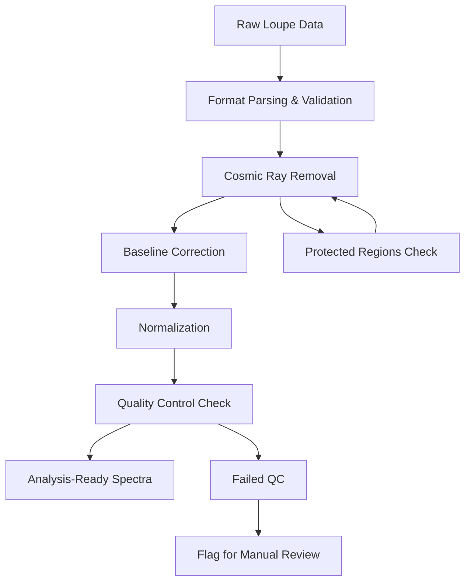
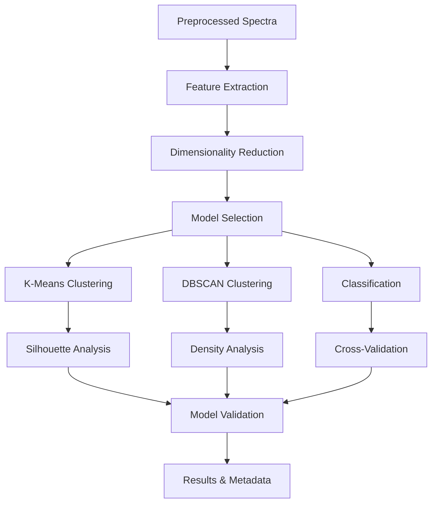

# Methods & Reproducibility

**SHERLOC Pipeline Analysis Framework**
**Version:** 3.0.0 (Sprint 3)
**Date:** 2026-01-25
**Pipeline SHA:** `git log -1 --format="%H"`

> **Freshness note (2026-04-28).** Dataset counts and Sprint 2 / Sprint 3 experimental result tables in this document describe the codebase and database state at the Sprint 3 cut-off (2026-01). Algorithm parameters and citation entries were re-audited against `src/sherloc_pipeline/config.yaml` and Crossref on 2026-04-28; see the public-release-prep audit log for detail. For current database statistics, run `sherloc db-stats`. A v4.0.0-aligned refresh of the experimental sections is planned but not blocking the public release.

---

## Table of Contents

1. [Data Provenance](#1-data-provenance)
2. [Preprocessing Pipeline](#2-preprocessing-pipeline)
3. [Peak Fitting Methods](#3-peak-fitting-methods)
4. [Machine Learning Methods](#4-machine-learning-methods)
5. [Vision Processing Methods](#5-vision-processing-methods)
6. [Statistical Analysis](#6-statistical-analysis)
7. [Software Environment](#7-software-environment)
8. [Hardware Specifications](#8-hardware-specifications)
9. [Reproducibility Guidelines](#9-reproducibility-guidelines)
10. [References](#10-references)

---

## 1. Data Provenance

### 1.1 Dataset Overview

The SHERLOC (Scanning Habitable Environments with Raman & Luminescence for Organics & Chemicals) instrument aboard the Mars 2020 Perseverance rover has collected spectroscopic data from Martian surface materials in Jezero Crater since Sol 58.

**Dataset Statistics (Sprint 3 snapshot, 2026-01):**

The values below describe the dataset as it existed at the Sprint 3 cut-off and are the basis for the Sprint 2 / Sprint 3 experimental results discussed later in this document. Run `sherloc db-stats` (or `sqlite3 ./phase.db ".tables"`) for current counts on the live database.

- **Total R1 Spectra:** 524,181
- **Total Scans:** 981
- **Total Sols:** 152
- **Mars Target Scans:** 648 (66.1%)
- **Calibration Scans:** 333 (33.9%)
- **Detail Scans (100 points):** 344
- **Database Size:** 2.22 GB
- **Collection Period:** Sol 58 - Sol 1266

### 1.2 SHERLOC Instrument Specifications

Drawn from Bhartia et al. (2021) and the codebase's Loupe-derived calibration in `src/sherloc_pipeline/config.yaml`. See `docs/schema/SPECTRAL_REGIONS.md` for the authoritative wavelength↔wavenumber mapping.

| Parameter | Specification |
|-----------|---------------|
| **Laser** | Pulsed deep-UV neon-copper, 248.6 nm (40 μs pulses) |
| **Spectral Regions** | R1 (Raman), R2/R3 (Fluorescence) |
| **R1 Range** | 250-282 nm; usable Raman shift ~640-4200 cm⁻¹ |
| **R2 Range** | 282-337.8 nm |
| **R3 Range** | 337.8-357.4 nm |
| **Spot Size** | ~100 μm diameter |
| **Working Distance** | ~48 mm (Bhartia et al. 2021) |

### 1.3 Data Sources and Processing Levels

**Primary Data Source:** SHERLOC Loupe v5.1.5 format files [@Bhartia2021; @Loupe2022]
- **Format:** Proprietary binary with embedded metadata
- **Processing Level:** EDR (Experimental Data Record) to RDR (Reduced Data Record)
- **Calibration:** Dark subtraction, flat-field correction applied

**Scan Types:**
1. **Point Scans:** Single-point measurements (1-10 points)
2. **Line Scans:** Linear transects (10-50 points)
3. **Detail Scans:** High-resolution grids (10×10 = 100 points)
4. **Calibration Scans:** Standard materials (AlGaN, Teflon, Polycarbonate)

**Acquisition Parameters:**
- **Pulses per Point (PPP):** 25-1000 (median: 100)
- **Integration Time:** Variable (5-60 seconds per point)
- **Laser Energy:** ~15-50 μJ per pulse
- **Atmospheric Pressure:** ~6-8 mbar (CO₂ dominated)

### 1.4 Target Context Integration

**Target Field Enhancement (Sprint 3):**
- **Geological Context:** Added target field to 967/981 scans (98.6%)
- **Target Categories:** Rock outcrops, regolith, drill tailings, calibration materials
- **Spatial Context:** ACI imagery linked via SCLK timestamps (±5-60s tolerance)

---

## 2. Preprocessing Pipeline

The preprocessing pipeline transforms raw Loupe format data into analysis-ready spectral arrays through a series of validated processing steps.

### 2.1 Data Ingestion and Validation

**Format Parsing:**
```python
# Loupe format parsing with validation
def parse_loupe_scan(file_path: Path) -> List[Spectrum]:
    """Parse Loupe binary format to Pydantic Spectrum models."""
    # Binary structure parsing with CRC validation
    # Metadata extraction (sol, target, coordinates)
    # Spectral array reconstruction
```

**Quality Control Checks:**
- Header CRC validation
- Spectral array completeness
- Wavelength calibration verification
- Metadata consistency checks

### 2.2 Cosmic Ray and Spike Removal

**Algorithm:** Robust rolling-median residual with MAD-derived threshold [@Whitaker2018]

**Parameters (`DespikeParams`):**
```python
window_size: int = 7              # Rolling window size
zscore_threshold: float = 6.0     # Robust z-score cutoff
max_iterations: int = 1           # Despiking passes
interpolation_method: str = "linear"
run_length_max: int = 2           # Maximum consecutive spikes
```

**Protected Regions:**
- **Laser line:** 600-700 cm⁻¹ (excluded from despiking)
- **Sulfate guard:** 990-1050 cm⁻¹ (conditional protection for genuine peaks)

**Implementation:**
```python
def despike_r1_spectrum(intensity_series: pd.Series,
                       params: DespikeParams) -> pd.Series:
    """Remove cosmic ray spikes using robust statistics."""
    # Compute rolling median and MAD
    median = intensity_series.rolling(window=params.window_size,
                                    center=True).median()
    residual = intensity_series - median
    mad = np.median(np.abs(residual - np.median(residual)))

    # Flag outliers exceeding z-score threshold
    threshold = params.zscore_threshold * 1.4826 * mad
    spikes = np.abs(residual) > threshold

    # Apply run-length and exclusion constraints
    # Interpolate flagged spikes
```

### 2.3 Baseline Correction

**Primary Method:** Adaptive smoothness penalized least squares (aspls) [@Zhang2020], as implemented by `pybaselines.Baseline.aspls` [@PyBaselines2022].

**Parameters (`BaselineParams`, defaults from `src/sherloc_pipeline/config.yaml`):**
```python
lam: float = 1.0e6         # Smoothness parameter (higher = smoother)
asymmetric_coef: float = 0.01  # Asymmetry coefficient
iters: int = 10            # Maximum iterations
diff_order: int = 2        # Difference operator order
tol: float = 0.001         # Convergence tolerance
```

The aspls algorithm adapts the smoothness penalty along the spectrum, allowing flatter regions to receive stronger smoothing than peak-rich regions. R1 fits also apply soft "keep windows" (configurable in `config.yaml`) that down-weight the baseline within ranges where genuine peaks are expected, reducing under-fit at strong features.

### 2.4 Normalization Strategies

**Vector Normalization (Default):**
```python
def l2_normalize(spectrum: np.ndarray) -> np.ndarray:
    """L2 normalization to unit vector length."""
    return spectrum / np.linalg.norm(spectrum)
```

**Alternative Normalization Methods:**
- **Min-Max:** Scale to [0, 1] range
- **Standard:** Zero mean, unit variance
- **Robust:** Median centering, MAD scaling
- **Peak:** Normalize to highest peak intensity

---

## 3. Peak Fitting Methods

### 3.1 Multi-Gaussian Fitting

**Model:** Sum of independent Gaussian peaks
```python
def gaussian(x: np.ndarray, center: float, amplitude: float,
             fwhm: float) -> np.ndarray:
    """Single Gaussian peak model."""
    sigma = fwhm / (2 * np.sqrt(2 * np.log(2)))
    return amplitude * np.exp(-0.5 * ((x - center) / sigma) ** 2)

def multi_gaussian(x: np.ndarray, params: np.ndarray) -> np.ndarray:
    """Sum of Gaussians: params = [m1,a1,f1, m2,a2,f2, ...]"""
    y = np.zeros_like(x)
    for i in range(0, params.size, 3):
        center, amplitude, fwhm = params[i:i+3]
        y += gaussian(x, center, amplitude, fwhm)
    return y
```

### 3.2 Peak Detection and Initial Estimates

**Peak Detection:** SciPy `find_peaks` with adaptive thresholds
```python
def detect_peaks(spectrum: np.ndarray, wavenumber: np.ndarray,
                prominence_factor: float = 0.1) -> List[int]:
    """Detect peak candidates using adaptive prominence."""
    baseline_noise = np.std(spectrum[:50])  # Estimate from edges
    min_prominence = max(prominence_factor * np.max(spectrum),
                        3 * baseline_noise)

    peaks, properties = find_peaks(spectrum,
                                  prominence=min_prominence,
                                  width=2,  # Minimum width in channels
                                  distance=5)  # Minimum separation
    return peaks
```

### 3.3 Nonlinear Optimization

**Method:** Trust Region Reflective (scipy.optimize.least_squares)
```python
def fit_peaks(wavenumber: np.ndarray, intensity: np.ndarray,
              initial_params: np.ndarray) -> FitResult:
    """Fit multiple Gaussian peaks to spectrum."""

    def residuals(params):
        model = multi_gaussian(wavenumber, params)
        return intensity - model

    # Parameter bounds: [center_min, amplitude_min, fwhm_min, ...]
    bounds = build_parameter_bounds(initial_params, wavenumber)

    result = least_squares(residuals, initial_params,
                          bounds=bounds, method='trf',
                          ftol=1e-12, xtol=1e-12, gtol=1e-12)

    return build_fit_result(result, wavenumber, intensity)
```

### 3.4 Model Selection and Quality Metrics

Two model-selection strategies are supported for choosing the number of Gaussian components: a sequential F-test (default) and AICc. Both operate on the same candidate seeds and the same nonlinear least-squares fit; they differ only in the rule used to stop adding peaks.

**Sequential F-test (default):**

Adds peaks one at a time starting from the null model (y=0). After each addition, computes the F-statistic for the nested-model comparison:

```
F = ((RSS_n − RSS_{n+1}) / Δk) / (RSS_{n+1} / dof_{n+1})
```

with Δk=3 (each Gaussian adds m, a, fwhm) and dof = N − 3·peaks. The F-distribution gives a p-value; if `p < ftest_alpha` (default 0.01) the new peak is retained and the search continues. **The first non-significant addition halts the search** (greedy stop). Strict statistical control over the false-positive rate per addition; assumes Gaussian residuals.

```python
def f_test_pvalue(rss_reduced: float, rss_full: float,
                  dof_reduced: int, dof_full: int,
                  delta_params: int) -> float:
    """p-value for nested-model F-test (Δk=3 per Gaussian)."""
    f_stat = ((rss_reduced - rss_full) / delta_params) / (rss_full / dof_full)
    return 1.0 - f_dist.cdf(f_stat, delta_params, dof_full)
```

**Corrected Akaike Information Criterion (AICc):**

Fits every candidate peak count from `aicc_min` (default 1) to `aicc_max` and picks the one minimizing AICc. No threshold; balances goodness-of-fit against parameter count via the +2k penalty term plus a small-sample correction.

```python
def compute_aicc(n_samples: int, rss: float, num_params: int) -> float:
    """Compute AICc for model selection."""
    aic = n_samples * np.log(rss / n_samples) + 2 * num_params
    correction = 2 * num_params * (num_params + 1) / (n_samples - num_params - 1)
    return aic + correction
```

For fluorescence fitting (`domain="fluorescence"`), AICc is used regardless of UI selection — see §3.5 of `docs/specs/FLUORESCENCE_FITTING_SPEC.md`.

**Quality Thresholds (defaults from `src/sherloc_pipeline/config.yaml`, minerals domain):**
- **R²:** ≥ 0.25 (`r_squared_min`)
- **SNR:** ≥ 3.0 (`min_snr`)
- **FWHM:** initial-search lower bound 22 cm⁻¹ (`fit_fwhm_min_initial_cm1`), upper bound 90 cm⁻¹ (`fwhm_max_cm1`); post-fit filter ≥ 30 cm⁻¹ (`filter_fwhm_min_cm1`); reviewable/persist eligibility ≥ 25 cm⁻¹ (`reviewable_fwhm_min_cm1`)

Domain overrides (organics, hydration, fluorescence) are defined in the same `fitting:` block of `config.yaml` and may relax or tighten these defaults. The fluorescence `posthoc_filters` block sets `r2_min: 0.0` and `fwhm_min_cm1: 0.0` — see §3.5 of `docs/specs/FLUORESCENCE_FITTING_SPEC.md` for the rationale.

**References:**
- F-test for nested models: standard derivation; implementation in `core/fitting.py:_f_test_pvalue`.
- AICc: Burnham & Anderson (2002), *Model Selection and Multimodel Inference*; implementation in `core/fitting.py:_compute_aicc`.

---

## 4. Machine Learning Methods

### 4.1 Clustering Analysis

#### 4.1.1 K-Means Clustering

**Implementation:** scikit-learn KMeans with Lloyd's algorithm
```python
from sklearn.cluster import KMeans
from sklearn.preprocessing import StandardScaler
from sklearn.decomposition import PCA

def cluster_spectra(spectra: np.ndarray, n_clusters: int) -> ClusteringResult:
    """Perform K-means clustering on spectral data."""
    # Preprocessing
    scaler = StandardScaler()
    X_scaled = scaler.fit_transform(spectra)

    # Optional dimensionality reduction
    pca = PCA(n_components=50, random_state=42)
    X_reduced = pca.fit_transform(X_scaled)

    # Clustering
    kmeans = KMeans(n_clusters=n_clusters,
                   random_state=42,
                   n_init=10,
                   max_iter=300,
                   tol=1e-4)
    labels = kmeans.fit_predict(X_reduced)

    # Quality metrics
    silhouette = silhouette_score(X_reduced, labels)

    return ClusteringResult(labels=labels,
                          silhouette_score=silhouette,
                          cluster_centers=kmeans.cluster_centers_)
```

**Hyperparameters (Sprint 2 Optimal):**
- **n_clusters:** 5 (silhouette-optimized)
- **init:** 'k-means++'
- **n_init:** 10
- **random_state:** 42 (reproducibility)
- **algorithm:** 'lloyd'

#### 4.1.2 DBSCAN (Density-Based Clustering)

**Implementation:** Scikit-learn DBSCAN with epsilon-neighborhood
```python
from sklearn.cluster import DBSCAN

def dbscan_cluster(spectra: np.ndarray, eps: float,
                   min_samples: int) -> ClusteringResult:
    """Density-based clustering for outlier detection."""
    dbscan = DBSCAN(eps=eps,
                   min_samples=min_samples,
                   metric='euclidean',
                   n_jobs=-1)
    labels = dbscan.fit_predict(spectra)

    # Separate core samples from noise (-1 labels)
    n_clusters = len(set(labels)) - (1 if -1 in labels else 0)
    n_noise = list(labels).count(-1)

    return ClusteringResult(labels=labels,
                          n_clusters=n_clusters,
                          noise_points=n_noise)
```

**Hyperparameters (Sprint 2):**
- **eps:** 0.1284 (optimized via k-distance plot)
- **min_samples:** 5 (2D rule of thumb: 2×dimensions)
- **metric:** 'euclidean'

### 4.2 Classification Methods

#### 4.2.1 Calibration vs. Mars Classification

**Best Model:** Gradient Boosting Classifier (96.95% accuracy)
```python
from sklearn.ensemble import GradientBoostingClassifier
from sklearn.model_selection import cross_val_score

def train_calibration_classifier(spectra: np.ndarray,
                                labels: np.ndarray) -> GradientBoostingClassifier:
    """Train binary classifier for calibration vs. Mars scans."""
    # Preprocessing pipeline
    scaler = StandardScaler()
    pca = PCA(n_components=50, random_state=42)

    X_scaled = scaler.fit_transform(spectra)
    X_reduced = pca.fit_transform(X_scaled)

    # Gradient boosting classifier
    gb_classifier = GradientBoostingClassifier(
        n_estimators=100,
        learning_rate=0.1,
        max_depth=3,
        random_state=42,
        subsample=0.8,
        min_samples_split=20,
        min_samples_leaf=10
    )

    # Cross-validation
    cv_scores = cross_val_score(gb_classifier, X_reduced, labels,
                               cv=5, scoring='accuracy')

    gb_classifier.fit(X_reduced, labels)
    return gb_classifier
```

**Model Comparison Results (Sprint 2):**
| Algorithm | Test Accuracy | CV Mean ± Std | Precision | Recall | F1 Score |
|-----------|---------------|---------------|-----------|--------|----------|
| **GradientBoosting** | **96.95%** | **96.17 ± 1.2%** | **0.980** | **0.962** | **0.971** |
| RandomForest | 96.45% | 95.41 ± 1.8% | 0.980 | 0.952 | 0.966 |
| LogisticRegression | 91.37% | 93.62 ± 2.1% | 0.885 | 0.962 | 0.922 |
| SVM (RBF) | 90.86% | 91.71 ± 2.4% | 0.884 | 0.952 | 0.917 |

### 4.3 Dimensionality Reduction

#### 4.3.1 Principal Component Analysis (PCA)

**Implementation:** Incremental PCA for large datasets
```python
from sklearn.decomposition import PCA, IncrementalPCA

def apply_pca(spectra: np.ndarray, n_components: int = 50) -> tuple:
    """Apply PCA with explained variance analysis."""

    # For large datasets, use incremental PCA
    if spectra.shape[0] > 10000:
        pca = IncrementalPCA(n_components=n_components)
        batch_size = 1000
        for i in range(0, spectra.shape[0], batch_size):
            batch = spectra[i:i+batch_size]
            pca.partial_fit(batch)
        X_reduced = pca.transform(spectra)
    else:
        pca = PCA(n_components=n_components, random_state=42)
        X_reduced = pca.fit_transform(spectra)

    return X_reduced, pca.explained_variance_ratio_
```

**Sprint 2 Results:**
- **Components:** 50
- **Explained Variance:** 17.7% (indicating high spectral dimensionality)
- **Cumulative Variance:** First 10 components explain 9.2%

#### 4.3.2 UMAP (Uniform Manifold Approximation) [Sprint 3]

**Implementation:** Three-method approach for comprehensive analysis
```python
import umap
from sklearn.model_selection import train_test_split

# Method 1: Standard UMAP (CPU)
def standard_umap(spectra: np.ndarray) -> np.ndarray:
    """Standard UMAP dimensionality reduction."""
    reducer = umap.UMAP(
        n_neighbors=15,
        n_components=2,
        min_dist=0.1,
        metric='euclidean',
        random_state=42,
        n_jobs=-1
    )
    return reducer.fit_transform(spectra)

# Method 2: GPU UMAP (cuML/RAPIDS)
def gpu_umap(spectra: np.ndarray) -> np.ndarray:
    """GPU-accelerated UMAP using cuML."""
    from cuml.manifold import UMAP as cuUMAP

    reducer = cuUMAP(
        n_neighbors=15,
        n_components=2,
        min_dist=0.1,
        metric='euclidean',
        random_state=42
    )
    return reducer.fit_transform(spectra)

# Method 3: Parametric UMAP (hybrid training)
def parametric_umap(spectra: np.ndarray, sample_size: int = 50000) -> tuple:
    """Parametric UMAP with neural network encoder."""
    from umap.parametric_umap import ParametricUMAP
    import tensorflow as tf

    # Stratified + diversity sampling for training
    train_spectra = hybrid_sample(spectra, sample_size)

    # Neural network architecture
    encoder = tf.keras.Sequential([
        tf.keras.layers.Dense(512, activation='relu'),
        tf.keras.layers.Dropout(0.2),
        tf.keras.layers.Dense(256, activation='relu'),
        tf.keras.layers.Dropout(0.2),
        tf.keras.layers.Dense(128, activation='relu'),
        tf.keras.layers.Dense(2)  # 2D embedding
    ])

    reducer = ParametricUMAP(
        encoder=encoder,
        n_neighbors=15,
        n_components=2,
        min_dist=0.1,
        metric='euclidean',
        random_state=42
    )

    # Train on subset, apply to full dataset
    reducer.fit(train_spectra)
    full_embedding = reducer.transform(spectra)

    return full_embedding, reducer
```

**Sprint 3 UMAP Strategy:**
- **Standard UMAP:** Full 524K dataset, baseline 30-60 min
- **GPU UMAP:** Full 524K dataset, ~5-10 min with RTX 3090 Ti
- **Parametric UMAP:** 50K hybrid sample training, project full 524K

---

## 5. Vision Processing Methods

### 5.1 ACI Image Processing

#### 5.1.1 Image Format Support

**VICAR Format Parser:**
```python
def read_vicar_image(file_path: Path) -> tuple[np.ndarray, dict]:
    """Read VICAR format ACI images with metadata extraction."""
    with open(file_path, 'rb') as f:
        # Parse VICAR label
        label = parse_vicar_label(f)

        # Extract image dimensions and data type
        width = label['NS']  # Number of samples
        height = label['NL']  # Number of lines
        data_type = label['FORMAT']

        # Read binary image data
        f.seek(label['LBLSIZE'])
        image_data = np.frombuffer(f.read(), dtype=data_type)
        image = image_data.reshape(height, width)

    return image, label
```

**ACI Specifications:**
- **Sensor:** 1648 × 1200 pixels
- **Resolution:** 10.1 μm/pixel
- **Field of View:** 16.6 × 12.1 mm
- **Format:** 8-bit grayscale, uncompressed
- **Metadata:** VICAR/PDS3 labels with acquisition parameters

### 5.2 Grain Segmentation

#### 5.2.1 Segment Anything Model (SAM)

**Primary Model:** SAM ViT-B (Vision Transformer Base)
```python
from segment_anything import SamAutomaticMaskGenerator, sam_model_registry

def setup_sam_segmenter() -> SamAutomaticMaskGenerator:
    """Initialize SAM ViT-B for grain segmentation."""
    sam_checkpoint = "models/sam_vit_b_01ec64.pth"
    device = "cuda" if torch.cuda.is_available() else "cpu"

    sam = sam_model_registry["vit_b"](checkpoint=sam_checkpoint)
    sam.to(device=device)

    mask_generator = SamAutomaticMaskGenerator(
        model=sam,
        points_per_side=32,      # Grid density for prompt points
        pred_iou_thresh=0.86,    # Quality threshold
        stability_score_thresh=0.92,  # Stability threshold
        min_mask_region_area=100,     # ~10 μm² minimum area
        box_nms_thresh=0.7,     # Non-maximum suppression
        crop_n_layers=0,        # No crop/zoom layers
    )

    return mask_generator
```

**Performance Comparison (RTX 3090 Ti):**
| Model | Masks/Image | Time (s) | GPU Memory | Quality |
|-------|-------------|----------|------------|---------|
| **SAM ViT-B** | **54** | **2.2** | **2.7 GB** | **Best** |
| MobileSAM | 30 | 2.4 | 2.7 GB | Good |
| Watershed | 1140 | 0.4 | 0 GB | Baseline |

#### 5.2.2 Watershed Fallback

**Traditional Computer Vision:** Watershed segmentation for compatibility
```python
from skimage.segmentation import watershed
from skimage.feature import peak_local_maxima
from scipy.ndimage import distance_transform_edt

def watershed_segmentation(image: np.ndarray) -> np.ndarray:
    """Watershed-based grain segmentation fallback."""
    # Preprocessing
    blurred = gaussian_filter(image, sigma=1.0)

    # Distance transform for marker generation
    binary = blurred > threshold_otsu(blurred)
    distance = distance_transform_edt(binary)

    # Find local maxima as seeds
    local_maxima = peak_local_maxima(distance,
                                   min_distance=10,
                                   threshold_abs=5)
    markers = np.zeros_like(distance, dtype=int)
    markers[tuple(local_maxima.T)] = np.arange(1, len(local_maxima) + 1)

    # Watershed segmentation
    labels = watershed(-distance, markers, mask=binary)

    return labels
```

### 5.3 Grain Morphometry

#### 5.3.1 Size Distribution Analysis

**Wentworth Size Classification:**
```python
from enum import Enum

class SizeClass(Enum):
    """Wentworth grain size classification for geological materials."""
    VERY_COARSE_SAND = (1000, 2000, "Very coarse sand")
    COARSE_SAND = (500, 1000, "Coarse sand")
    MEDIUM_SAND = (250, 500, "Medium sand")
    FINE_SAND = (125, 250, "Fine sand")
    VERY_FINE_SAND = (62.5, 125, "Very fine sand")
    COARSE_SILT = (31.25, 62.5, "Coarse silt")

def classify_grain_size(equivalent_diameter_um: float) -> SizeClass:
    """Classify grain size according to Wentworth scale."""
    for size_class in SizeClass:
        min_size, max_size, _ = size_class.value
        if min_size <= equivalent_diameter_um <= max_size:
            return size_class
    return SizeClass.VERY_FINE_SAND  # Default for smaller grains
```

#### 5.3.2 Shape Analysis

**Morphometric Parameters:**
```python
from skimage.measure import regionprops

def compute_grain_morphometry(mask: np.ndarray,
                            pixel_scale_um: float = 10.1) -> dict:
    """Compute comprehensive grain morphometry metrics."""
    props = regionprops(mask.astype(int))[0]

    # Size metrics
    area_pixels = props.area
    area_um2 = area_pixels * (pixel_scale_um ** 2)
    equivalent_diameter_um = 2 * np.sqrt(area_um2 / np.pi)

    # Shape metrics
    perimeter_pixels = props.perimeter
    perimeter_um = perimeter_pixels * pixel_scale_um

    # Circularity (4π×Area/Perimeter²)
    circularity = 4 * np.pi * area_pixels / (perimeter_pixels ** 2)

    # Aspect ratio (major/minor axis length)
    aspect_ratio = props.major_axis_length / props.minor_axis_length

    # Centroid coordinates
    centroid_y, centroid_x = props.centroid

    return {
        'area_um2': area_um2,
        'equivalent_diameter_um': equivalent_diameter_um,
        'perimeter_um': perimeter_um,
        'circularity': circularity,
        'aspect_ratio': aspect_ratio,
        'centroid_x': centroid_x * pixel_scale_um,
        'centroid_y': centroid_y * pixel_scale_um,
        'major_axis_um': props.major_axis_length * pixel_scale_um,
        'minor_axis_um': props.minor_axis_length * pixel_scale_um
    }
```

**Sprint 2 Morphometry Results (14,852 grains):**
| Metric | Mean | Median | Std Dev |
|--------|------|--------|---------|
| Equivalent Diameter (μm) | 870.5 | 599.8 | 1161.3 |
| Circularity | 0.480 | 0.480 | 0.192 |
| Aspect Ratio | 4.02 | 1.52 | 8.64 |

---

## 6. Statistical Analysis

### 6.1 Quality Metrics

#### 6.1.1 Clustering Validation

**Silhouette Analysis:**
```python
from sklearn.metrics import silhouette_score, silhouette_samples

def evaluate_clustering_quality(X: np.ndarray, labels: np.ndarray) -> dict:
    """Comprehensive clustering quality assessment."""
    # Global silhouette score
    global_silhouette = silhouette_score(X, labels)

    # Per-sample silhouette coefficients
    sample_silhouettes = silhouette_samples(X, labels)

    # Per-cluster analysis
    cluster_scores = {}
    for cluster_id in np.unique(labels):
        if cluster_id == -1:  # Skip noise points in DBSCAN
            continue
        mask = labels == cluster_id
        cluster_silhouettes = sample_silhouettes[mask]
        cluster_scores[cluster_id] = {
            'mean_silhouette': np.mean(cluster_silhouettes),
            'std_silhouette': np.std(cluster_silhouettes),
            'size': np.sum(mask)
        }

    return {
        'global_silhouette': global_silhouette,
        'cluster_scores': cluster_scores,
        'sample_silhouettes': sample_silhouettes
    }
```

#### 6.1.2 Classification Metrics

**Cross-Validation Strategy:**
```python
from sklearn.model_selection import StratifiedKFold, cross_validate

def evaluate_classifier(model, X: np.ndarray, y: np.ndarray) -> dict:
    """Comprehensive classifier evaluation with cross-validation."""

    # Stratified 5-fold cross-validation
    cv = StratifiedKFold(n_splits=5, shuffle=True, random_state=42)

    scoring_metrics = ['accuracy', 'precision', 'recall', 'f1', 'roc_auc']
    cv_results = cross_validate(model, X, y, cv=cv,
                               scoring=scoring_metrics,
                               return_train_score=True)

    # Aggregate statistics
    results = {}
    for metric in scoring_metrics:
        test_scores = cv_results[f'test_{metric}']
        results[metric] = {
            'mean': np.mean(test_scores),
            'std': np.std(test_scores),
            'scores': test_scores
        }

    return results
```

### 6.2 Statistical Tests

#### 6.2.1 Distribution Comparisons

**Kolmogorov-Smirnov Tests:**
```python
from scipy.stats import ks_2samp, mannwhitneyu

def compare_spectral_distributions(group1: np.ndarray,
                                 group2: np.ndarray) -> dict:
    """Statistical comparison of spectral intensity distributions."""

    # Kolmogorov-Smirnov test for distribution similarity
    ks_statistic, ks_pvalue = ks_2samp(group1.flatten(),
                                      group2.flatten())

    # Mann-Whitney U test for median differences
    mw_statistic, mw_pvalue = mannwhitneyu(group1.flatten(),
                                          group2.flatten(),
                                          alternative='two-sided')

    return {
        'ks_test': {'statistic': ks_statistic, 'p_value': ks_pvalue},
        'mw_test': {'statistic': mw_statistic, 'p_value': mw_pvalue},
        'effect_size': np.median(group1) - np.median(group2)
    }
```

---

## 7. Software Environment

### 7.1 Core Dependencies

**Python Environment:**
```yaml
Python: ">=3.9"
Primary Dependencies:
  numpy: ">=1.20.0"      # Numerical computing
  pandas: ">=1.3.0"      # Data manipulation
  matplotlib: ">=3.5.0"  # Plotting and visualization
  scipy: ">=1.8.0"       # Scientific computing
  scikit-learn: ">=1.0.0" # Machine learning
  scikit-image: ">=0.19.0" # Image processing

Spectroscopy-Specific:
  pybaselines: ">=1.0.0" # Baseline correction

Deep Learning (Optional):
  torch: ">=2.0.0"       # PyTorch for SAM
  torchvision: ">=0.15.0"
  segment-anything: ">=1.0" # Meta SAM models

GPU Acceleration (Optional):
  cuml: ">=22.10.0"      # RAPIDS ML
  cudf: ">=22.10.0"      # RAPIDS DataFrames

Database:
  sqlalchemy: ">=2.0.0" # ORM and database abstraction
  alembic: ">=1.13.0"   # Database migrations

API Framework:
  pydantic: ">=1.10.0"  # Data validation
  typer: ">=0.9.0"      # CLI framework
  rich: ">=12.0.0"      # Terminal formatting
```

### 7.2 Version Control and Reproducibility

**Git SHA Tracking:**
```python
def get_code_sha() -> str:
    """Get current git commit SHA for reproducibility."""
    import subprocess
    try:
        result = subprocess.run(['git', 'rev-parse', 'HEAD'],
                              capture_output=True, text=True)
        return result.stdout.strip() if result.returncode == 0 else "unknown"
    except Exception:
        return "unknown"

# Embed in output metadata
metadata = {
    "schema_version": "1.0.0",
    "created_at": datetime.utcnow().isoformat(),
    "code_sha": get_code_sha(),
    "random_seed": 42,
    "python_version": sys.version,
    "numpy_version": np.__version__,
    "sklearn_version": sklearn.__version__
}
```

### 7.3 Configuration Management

**Centralized Configuration:**
```yaml
# config.yaml structure (excerpt; see src/sherloc_pipeline/config.yaml for full schema)
preprocessing:
  baseline_method: "aspls"
  despike:
    window_size: 7
    zscore_threshold: 6.0
    max_iterations: 1
  baseline:
    lam: 1.0e6
    asymmetric_coef: 0.01
    iters: 10
    diff_order: 2
    tol: 0.001

machine_learning:
  clustering:
    default_algorithm: "kmeans"
    kmeans:
      n_clusters: 5
      n_init: 10
      random_state: 42
    dbscan:
      eps: 0.1284
      min_samples: 5

  feature_extraction:
    pca_components: 50
    normalization: "l2"

vision:
  sam:
    model_type: "vit_b"
    points_per_side: 32
    pred_iou_thresh: 0.86
    stability_score_thresh: 0.92
    min_mask_region_area: 100
```

---

## 8. Hardware Specifications

### 8.1 Computing Resources (Sprint 3)

**Primary Analysis Workstation:**
```yaml
CPU: Intel Core i9-12900KS
  Cores: 16 (8P + 8E)
  Threads: 24
  Base Clock: 3.4 GHz
  Boost Clock: 5.5 GHz
  Cache: 30 MB L3

GPU: NVIDIA GeForce RTX 3090 Ti
  VRAM: 24 GB GDDR6X
  CUDA Cores: 10,752
  Compute Capability: 8.6
  CUDA Version: 13.0
  Memory Bandwidth: 1008 GB/s

RAM: 128 GB DDR4-3200
  Available for Analysis: ~107 GB
  Full Dataset Fits: Yes (524K spectra)

Storage: 3.6 TB NVMe SSD
  Available: 3.4 TB
  Database Size: 2.22 GB
  Model Storage: ~15 GB
```

### 8.2 Performance Benchmarks

**Processing Times (524K spectra dataset):**
| Operation | Time | Notes |
|-----------|------|-------|
| **Full K-Means Clustering** | 30-60 min | CPU, k=5, PCA preprocessing |
| **GPU UMAP** | 5-10 min | cuML acceleration |
| **Standard UMAP** | 30-60 min | CPU implementation |
| **SAM Segmentation** | 2.2s/image | RTX 3090 Ti, ViT-B model |
| **Grain Morphometry** | 0.1s/image | Post-segmentation analysis |
| **Database Queries** | <1s | SQLite with proper indexing |

### 8.3 Memory Management

**Large Dataset Strategies:**
```python
def process_large_dataset(spectra_generator, batch_size: int = 1000):
    """Process datasets larger than available RAM using batching."""

    # Incremental PCA for dimensionality reduction
    ipca = IncrementalPCA(n_components=50)

    # Fit PCA incrementally
    for batch in batched(spectra_generator, batch_size):
        batch_array = np.vstack(batch)
        ipca.partial_fit(batch_array)

    # Transform full dataset incrementally
    transformed_batches = []
    for batch in batched(spectra_generator, batch_size):
        batch_array = np.vstack(batch)
        transformed_batch = ipca.transform(batch_array)
        transformed_batches.append(transformed_batch)

    return np.vstack(transformed_batches)
```

---

## 9. Reproducibility Guidelines

### 9.1 Random Seed Management

**Deterministic Results:**
```python
import numpy as np
import random
from sklearn.utils import check_random_state

# Global random seed for reproducibility
RANDOM_SEED = 42

def set_random_seeds(seed: int = RANDOM_SEED):
    """Set all random seeds for reproducible results."""
    np.random.seed(seed)
    random.seed(seed)

    # PyTorch (if available)
    try:
        import torch
        torch.manual_seed(seed)
        torch.cuda.manual_seed(seed)
        torch.cuda.manual_seed_all(seed)
        torch.backends.cudnn.deterministic = True
        torch.backends.cudnn.benchmark = False
    except ImportError:
        pass

# Apply consistently across all analysis
set_random_seeds(42)
```

### 9.2 Output Metadata Standards

**Mandatory Metadata for All Outputs:**
```python
@dataclass
class AnalysisMetadata:
    """Standardized metadata for all analysis outputs."""
    schema_version: str = "1.0.0"
    created_at: str = field(default_factory=lambda: datetime.utcnow().isoformat())
    code_sha: str = field(default_factory=get_code_sha)
    random_seed: int = 42
    python_version: str = field(default_factory=lambda: sys.version)

    # Library versions
    numpy_version: str = field(default_factory=lambda: np.__version__)
    pandas_version: str = field(default_factory=lambda: pd.__version__)
    sklearn_version: str = field(default_factory=lambda: sklearn.__version__)

    # Hardware context
    cpu_info: str = field(default_factory=get_cpu_info)
    gpu_info: str = field(default_factory=get_gpu_info)
    total_memory_gb: float = field(default_factory=get_memory_info)

    def to_dict(self) -> dict:
        """Convert to dictionary for JSON serialization."""
        return asdict(self)
```

### 9.3 Data Versioning

**Dataset Versioning Strategy:**
```python
def compute_dataset_hash(spectra_paths: List[Path]) -> str:
    """Compute reproducible hash for dataset version tracking."""
    import hashlib

    hasher = hashlib.sha256()

    # Sort paths for deterministic ordering
    sorted_paths = sorted(spectra_paths)

    for path in sorted_paths:
        # Hash file path and modification time
        hasher.update(str(path).encode())
        hasher.update(str(path.stat().st_mtime).encode())

    return hasher.hexdigest()[:16]  # First 16 characters
```

---

## 10. References

### 10.1 Primary Literature

```bibtex
@article{Bhartia2021,
  title={Perseverance's Scanning Habitable Environments with Raman and Luminescence for Organics and Chemicals (SHERLOC) Investigation},
  author={Bhartia, Rohit and Beegle, Luther W. and DeFlores, Lauren and Abbey, William and Razzell Hollis, Joseph and Uckert, Kyle and others},
  journal={Space Science Reviews},
  volume={217},
  pages={58},
  year={2021},
  publisher={Springer},
  doi={10.1007/s11214-021-00812-z}
}

@article{Zhang2020,
  title={Baseline correction for infrared spectra using adaptive smoothness parameter penalized least squares method},
  author={Zhang, Feng and Tang, Xiaojun and Tong, Angxin and Wang, Bin and Wang, Jingwei},
  journal={Spectroscopy Letters},
  volume={53},
  number={3},
  pages={222--233},
  year={2020},
  publisher={Taylor \& Francis},
  doi={10.1080/00387010.2020.1730908}
}

@article{Whitaker2018,
  title={A simple algorithm for despiking Raman spectra},
  author={Whitaker, Darren A and Hayes, Kevin},
  journal={Chemometrics and Intelligent Laboratory Systems},
  volume={179},
  pages={82--84},
  year={2018},
  publisher={Elsevier},
  doi={10.1016/j.chemolab.2018.06.009}
}

@article{Kirillov2023,
  title={Segment anything},
  author={Kirillov, Alexander and Mintun, Eric and Ravi, Nikhila and Mao, Hanzi and Rolland, Chloe and Gustafson, Laura and Xiao, Tete and Whitehead, Spencer and Berg, Alexander C and Lo, Wan-Yen and others},
  journal={arXiv preprint arXiv:2304.02643},
  year={2023}
}

@article{McInnes2018,
  title={UMAP: Uniform manifold approximation and projection},
  author={McInnes, Leland and Healy, John and Melville, James},
  journal={arXiv preprint arXiv:1802.03426},
  year={2018}
}

@article{Pedregosa2011,
  title={Scikit-learn: Machine learning in Python},
  author={Pedregosa, Fabian and Varoquaux, Ga{\"e}l and Gramfort, Alexandre and Michel, Vincent and Thirion, Bertrand and Grisel, Olivier and Blondel, Mathieu and Prettenhofer, Peter and Weiss, Ron and Dubourg, Vincent and others},
  journal={Journal of Machine Learning Research},
  volume={12},
  pages={2825--2830},
  year={2011}
}
```

### 10.2 Software and Data References

```bibtex
@software{Williford2024,
  author={Williford, Kenneth H.},
  title={SHERLOC Pipeline: Mars 2020 Raman/Fluorescence Data Processing},
  version={3.0.0},
  year={2024},
  url={https://github.com/archaeon-ai/sherloc-pipeline}
}

@software{Loupe2022,
  author={Uckert, Kyle},
  title={nasa/Loupe: LoupeV5.1.5},
  year={2022},
  publisher={Zenodo},
  doi={10.5281/zenodo.7062998},
  url={https://zenodo.org/records/7062998}
}

@software{PyBaselines2022,
  author={Erb, Donald},
  title={pybaselines: A Python library of algorithms for the baseline correction of experimental data},
  year={2022},
  url={https://github.com/derb12/pybaselines},
  doi={10.5281/zenodo.5608581}
}

@software{RAPIDS2023,
  author={{RAPIDS Development Team}},
  title={RAPIDS: GPU-Accelerated Data Science},
  version={22.10.0},
  year={2023},
  url={https://rapids.ai}
}
```

### 10.3 Standards and Conventions

```bibtex
@techreport{Wentworth1922,
  title={A scale of grade and class terms for clastic sediments},
  author={Wentworth, Chester K},
  journal={The Journal of Geology},
  volume={30},
  number={5},
  pages={377--392},
  year={1922},
  publisher={University of Chicago Press}
}

@article{Rousseeuw1987,
  title={Silhouettes: a graphical aid to the interpretation and validation of cluster analysis},
  author={Rousseeuw, Peter J},
  journal={Journal of Computational and Applied Mathematics},
  volume={20},
  pages={53--65},
  year={1987},
  publisher={Elsevier}
}

@book{Hastie2009,
  title={The elements of statistical learning: data mining, inference, and prediction},
  author={Hastie, Trevor and Tibshirani, Robert and Friedman, Jerome},
  year={2009},
  publisher={Springer},
  edition={2nd},
  doi={10.1007/978-0-387-84858-7}
}
```

---

## Appendix A: Algorithm Flowcharts

### A.1 Preprocessing Pipeline



### A.2 Machine Learning Workflow



---

*Document Version: 1.0.0*
*Generated: 2026-01-25*
*Pipeline Version: 3.0.0*
*Git SHA: [Embedded at runtime]*